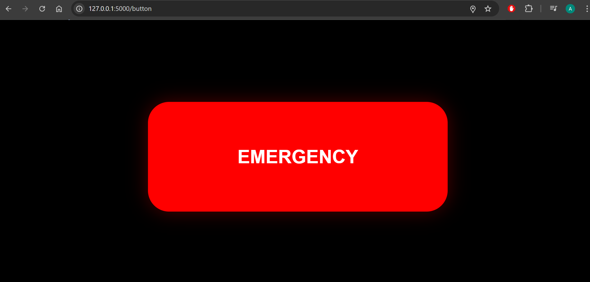
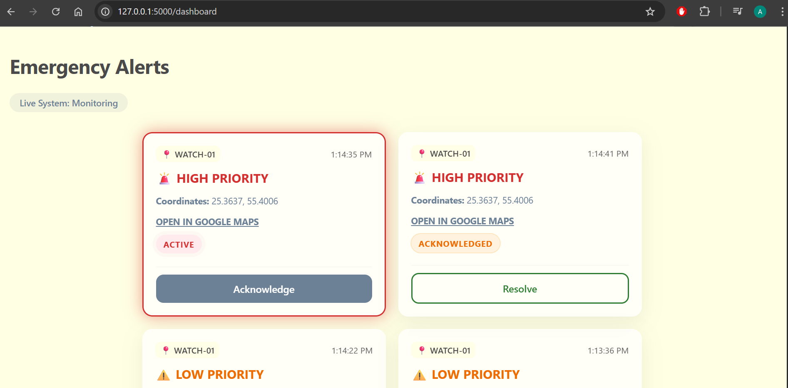
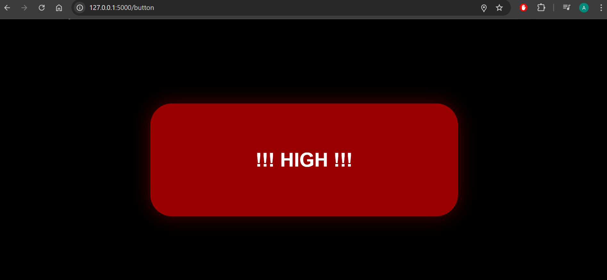
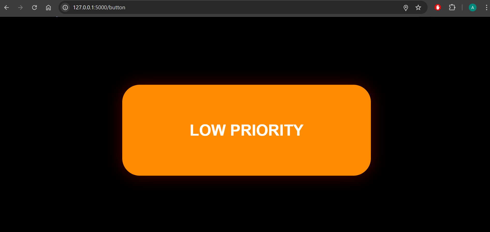

## Emergency Rescue Alert System

A full-stack emergency alert system built with Flask and the Google Maps API.

### Features
- SOS button interface with single-click (LOW RISK) and double-click (HIGH RISK) detection
- Device authentication on the Flask backend before alerts are accepted
- Real-time monitoring dashboard that polls for live alerts every 3 seconds
- Google Maps integration displaying sender geolocation on each alert card
- Manual alert resolution workflow: ACTIVE → ACKNOWLEDGED → RESOLVED

### Technologies Used
Python, Flask, SQLite, HTML, CSS, JavaScript, Google Maps API

### Setup
1. Install dependencies: pip install flask flask-cors
2. Register your device by sending a POST request to /api/devices/register
3. Run the backend: python backend/app2.py
4. Open http://localhost:5000/button and http://localhost:5000/dashboard

## Screenshots

### Emergency Button Interface

### Monitoring Dashboard

### High Priority Alert

### Low Priority Alert
